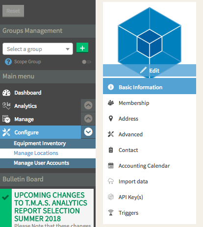

# tap-SMS

This is a [Singer](https://singer.io) tap that produces JSON-formatted data
following the [Singer
spec](https://github.com/singer-io/getting-started/blob/master/SPEC.md).

This tap:

- Pulls raw data from[SMS Software WEB API](https://storetraffic.com/)
- Extracts the following resources:
  - [Traffic](http://help.storetraffic.com/tmas-manage-locations-web-api?from_search=22892211)
- Outputs the schema for each resource
- Incrementally pulls data based on the input state

---

# Quick Start

1. Install

	pip install tap-SMS

2. Create the config file

   Create a JSON file called config.json. Its contents should look like:

```
 	{
    	 "start_date": "2015-01-01T10:20:00Z", 
	     "access_token": "1A2S3D4F5G6H7J8K9L0ZXCV",     
	     "username": "your-T.M.A.S.-username",
	     "password": "your-T.M.A.S.-password"
 	}
 ```
 
    The start_date specifies the date at which the tap will begin pulling data (for those resources that support this).
    
    To get a token, first, login to your SMS store traffic T.M.A.S. module using this [Link](https://www.smssoftware.net/tms/).
    
    Then, open the Configure tab, choose Manage Locations, and select API Keys. 
    
    Click "Add Key" and create a new API Key. This will generate your token.
    
3. Run the Tap in Discovery Mode

    tap-SMS -c config.json --discover > properties.json

4. Run the Tap in Sync Mode

    tap-SMS --config config.json --catalog properties.json
---

Copyright &copy; 2018 Stitch
